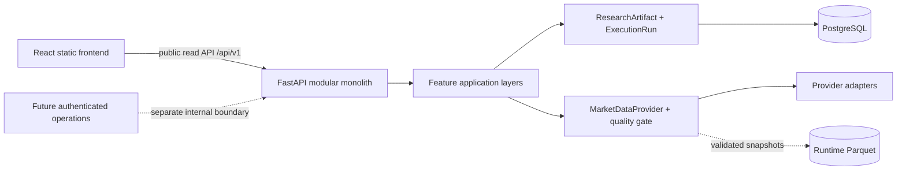

# Architecture

## System shape

A-Stock Lab is a production-grade modular monolith. One backend package owns feature modules,
shared domain concepts, persistence, and API delivery. The same backend package and image can later
start either the web process or a worker process; no worker is created in Phase 0.

## Backend boundaries

- `api/` is an HTTP delivery layer. `/api/v1` is the public versioned surface. `api/internal` is a
  reserved, unmounted boundary for future authenticated operational APIs.
- `features/<module>/domain` contains deterministic provider-independent rules and interfaces.
- `features/<module>/application` coordinates use cases.
- `features/<module>/adapters` contains concrete market-data, model, storage, and external service
  integrations.
- `shared/artifacts` is the versioned cross-module research output contract.
- `shared/execution` records auditable job lifecycle and implementation/provider context.
- `shared/market_data` contains provider-neutral market-data models, contracts, acceptance rules,
  and orchestration. Concrete SDK and Parquet code lives only in its `adapters` package; neutral
  modules never import those adapters.
- `database` owns SQLAlchemy metadata and sessions. Alembic is the only schema evolution mechanism.

Expensive actions such as market refreshes, OpenAI calls, quantitative runs, and Tail Radar execution
must not be added as anonymous public actions. Authentication is intentionally deferred; therefore
the operational router is not mounted.

The Phase 1 live snapshot path is an explicitly invoked diagnostic rather than an API route or
scheduler. This keeps network work out of request handling and prevents accidental polling while
provider reliability is being measured.

## Frontend boundaries

Each first-class module lives under `src/features`. Shared components are presentation-only. All HTTP
access flows through `src/lib/api/client.ts`, with feature-local typed API/query definitions. TanStack
Query owns server state; React Router owns navigation.

The UI is desktop-first and responsive, uses shared semantic color tokens, and supports light and
dark themes. Reserved modules show explicit empty states, never invented prices, charts, news, or AI
results.

## Time and historical integrity

`Asia/Shanghai` is the canonical A-share market timezone. Market and research timestamps are aware.
Every historical calculation carries an explicit `as_of`; adapters and services must prevent future
information from entering historical analysis.

## Observability

The backend emits JSON logs to standard output. Request middleware supplies `request_id`; run
orchestration can attach `run_id`, while feature and provider context are structured log fields.
Secrets and raw credentials must never be logged.
