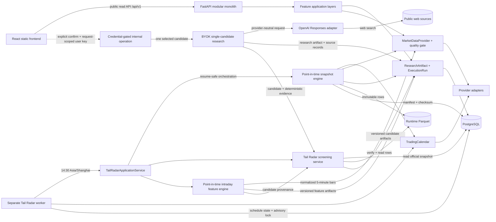

# Architecture

Trend Radar adds the `trend_radar` feature boundary. A local Windows operator window or CLI starts
scans; the website only reads exported JSON results. Local PostgreSQL owns evidence, schedule claims
and scan locking. See [ADR 0016](adr/0016-trend-radar-local-control-static-publication.md) and
[operations](trend-radar.md).

## System shape

A-Stock Lab is a production-grade modular monolith. One backend package owns feature modules,
shared domain concepts, persistence, and API delivery. The same backend package and image can later
start either the web process or a worker process; no worker is created in Phase 0.

## Backend boundaries

- `api/` is an HTTP delivery layer. `/api/v1` is the public read surface. `/api/internal/v1` is a
  separate operational boundary; its current write surface requires a request-scoped user OpenAI
  key, can start research for exactly one selected Tail Radar candidate, and cannot start a market
  scan. This credential gates provider access but is not A-Stock Lab user authentication.
- `features/<module>/domain` contains deterministic provider-independent rules and interfaces.
- `features/<module>/application` coordinates use cases.
- `features/<module>/adapters` contains concrete market-data, model, storage, and external service
  integrations.
- `shared/artifacts` is the versioned cross-module research output contract.
- `shared/execution` records auditable job lifecycle and implementation/provider context.
- `shared/market_data` contains provider-neutral market-data models, contracts, acceptance rules,
  and orchestration. Concrete SDK and Parquet code lives only in its `adapters` package; neutral
  modules never import those adapters.
- `database` owns SQLAlchemy metadata and sessions. Alembic is the only schema evolution mechanism.

Expensive actions such as market refreshes, quantitative runs, and Tail Radar execution must not be
added as anonymous public actions. The only mounted paid operation is single-candidate OpenAI
research; it requires explicit cost confirmation and the caller's own request-scoped provider key.
The site does not yet implement A-Stock Lab user authentication or authorization.

The Phase 1 live diagnostic, Phase 2 point-in-time execution CLI, and Phase 3/4 Tail Radar CLI are
explicitly invoked operations rather than API routes or schedulers. The snapshot execution engine
claims an official logical run before network work, resolves the trade date through
`TradingCalendar`, persists immutable rows
to Parquet, and transactionally registers the manifest with the successful run transition. Public
request handling never triggers market refreshes or screening. Tail Radar reads one verified
official Parquet snapshot, applies a versioned deterministic domain rule, and transactionally
publishes candidates as `ResearchArtifact` records plus feature-specific relational links.
Phase 4's internal candidate-analysis command fetches provider-neutral intraday bars, enforces the
explicit `analysis_as_of` cutoff in domain code, and publishes a separate deterministic feature
artifact. It does not alter screening membership. Phase 5's separate application service consumes
persisted candidate and eligible deterministic evidence, then delegates a provider-neutral request
to the OpenAI adapter. Only that adapter imports the SDK. It uses the Responses API, web search, and
strict structured output; the deterministic screening and feature paths never import or invoke AI.
The paid operation is CLI-only and claims its cache identity before making the external request.
Phase 6 composes the deterministic services in `TailRadarApplicationService`. Workflow version 2
stops after point-in-time intraday analysis and deliberately leaves AI research pending. AI runs
only through the explicitly confirmed, single-candidate operation using the caller's transient
OpenAI key and reuses the existing paid-call cache. Phase 7 consumes public read APIs for data and
uses that separate internal operation only after user confirmation. It presents raw market evidence,
deterministic calculations, and AI interpretation as distinct visual layers. Phase 8 runs a
separate process from the same backend image. It uses `TradingCalendar`, persists the daily
scheduling decision, and holds a PostgreSQL advisory lock while invoking the existing workflow.
FastAPI processes do not import or start the scheduler. A configurable narrow initial start window
preserves a missed 14:30 capture instead of backdating a later live request.

The overview derives only reliable exchange-board classifications from normalized symbols. These
support listing-board filtering and are not presented as industry classifications.

## Frontend boundaries

Each first-class module lives under `src/features`. Shared components are presentation-only. All HTTP
access flows through `src/lib/api/client.ts`, with feature-local typed API/query definitions. TanStack
Query owns server state; React Router owns navigation.

The UI is desktop-first and responsive, uses shared semantic color tokens, and supports light and
dark themes. Reserved modules show explicit empty states, never invented prices, charts, news, or AI
results.

## Time and historical integrity

`Asia/Shanghai` is the canonical A-share market timezone. Market and research timestamps are aware.
Every historical calculation carries an explicit `as_of`; adapters and services must prevent future
information from entering historical analysis.

Snapshot execution separately preserves intended time, actual fetch start/finish, legitimate
provider time, and persistence time. The official identity is unique by job type, trade date,
intended time, and execution version. Forced reruns are non-official and remain explicitly linked.
Tail Radar candidate `as_of` is the source snapshot's actual fetch-finish time; its evidence also
preserves the distinct intended snapshot time.
Intraday analysis separately preserves its own `analysis_as_of`; no bar ending later than that
boundary may enter quality evaluation or feature calculation.
AI research has its own aware `analysis_as_of`. Prompts enforce that publication time—not later
retrieval time—governs whether information was available at that boundary. Persisted source records
distinguish verified, uncertain, and unavailable publication timestamps and explicitly classify
availability at the historical boundary.

## Observability

The backend emits JSON logs to standard output. Request middleware supplies `request_id`; run
orchestration can attach `run_id`, while feature and provider context are structured log fields.
Secrets and raw credentials must never be logged. A browser-supplied OpenAI key exists only in page
memory and the request-scoped backend adapter; it is not persisted or returned.
